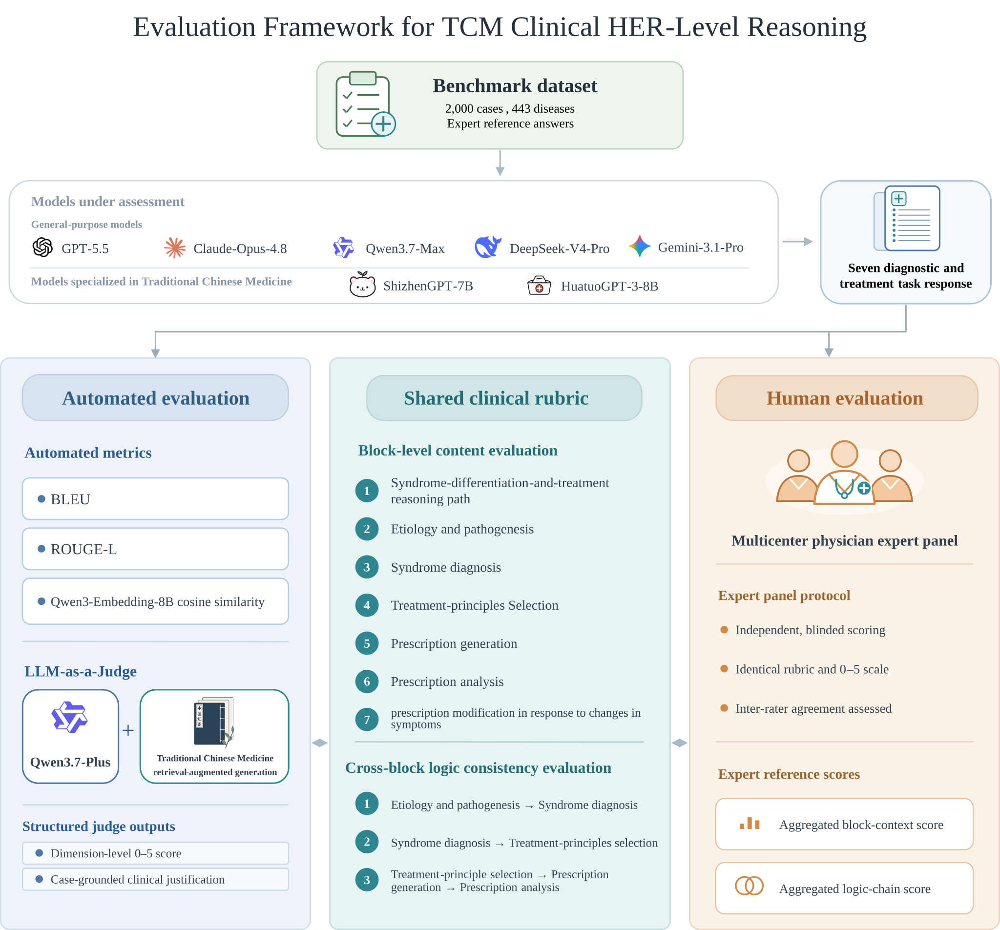
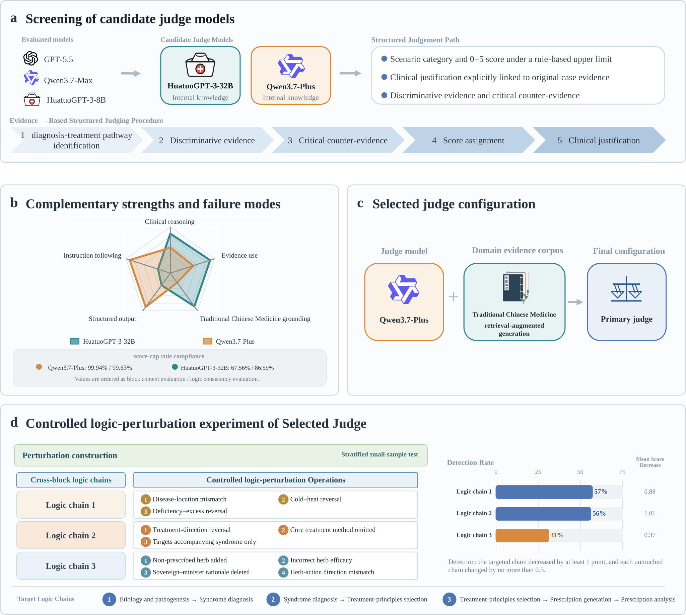
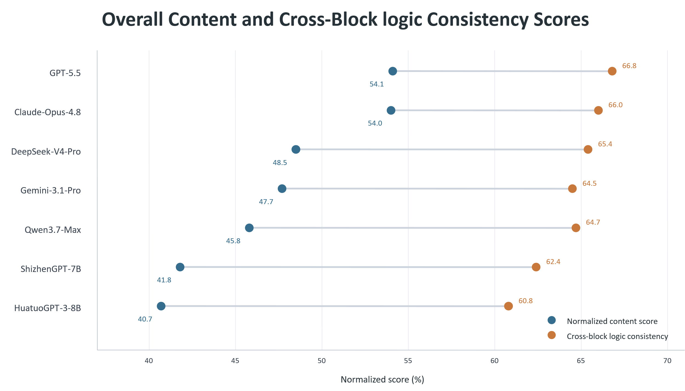

<div align="center">


*Can Language Models Reason from Pathogenesis to Prescription in Real-World Cases?*

[](LICENSE)
[](#-dataset)
[](#-dataset)
[](#-benchmark-design)

</div>

<p align="center">
  
</p>
<p align="center"><i>Figure 1: Overall evaluation framework of TCMClinicalReason-Bench.</i></p>

## 📋 Table of Contents

- [Introduction](#-introduction)
- [Benchmark Design](#-benchmark-design)
- [Dataset](#-dataset)
- [Preliminary Study](#-preliminary-study)
- [Evaluation and Leaderboard](#-evaluation-and-leaderboard)
- [Evaluation and Data Access](#-evaluation-and-data-access)
- [Code](#-code)
- [Repository Structure](#-repository-structure)
- [Citation](#-citation)
- [License and Contact](#-license-and-contact)

## 📖 Introduction

TCMClinicalReason-Bench is a benchmark built from 2,000 authentic clinical case records documented by renowned senior TCM physicians, curated from multicenter electronic health records and published TCM case reports. Each case is decomposed into a complete seven-step diagnostic and therapeutic sequence, and model outputs are scored along two complementary axes: **case-grounded content adequacy** of each reasoning block and **logic consistency** across the dependencies between blocks. The benchmark is designed to accept clinically defensible alternative pathways rather than reward string overlap with a single reference answer.

## 🧩 Benchmark Design

Each case requires an open-ended response covering **seven sequential reasoning blocks**:

1. Syndrome-differentiation-and-treatment reasoning path
2. Etiology and pathogenesis analysis
3. Syndrome diagnosis
4. Treatment-principle selection
5. Prescription generation
6. Prescription analysis
7. Prescription modification in response to changes in symptoms

On top of the blocks, **three cross-block reasoning chains** are scored separately:

- Etiology and pathogenesis analysis → syndrome diagnosis
- Syndrome diagnosis → treatment-principle selection
- Treatment-principle selection → prescription generation → prescription analysis

Cases are stratified into three difficulty tiers (easy 666 / medium 667 / hard 667) using embedding-based similarity between reference answers and the outputs of two TCM-specialized models, so that performance can be read as a function of case complexity.

## 📊 Dataset

The released test set is `data/TCMCR-Reasoning.json`: 2,000 cases in the full seven-block format. The model reads the case and produces the complete diagnostic and therapeutic sequence (syndrome-differentiation-and-treatment reasoning path, etiology and pathogenesis analysis, syndrome diagnosis, treatment-principle selection, prescription generation, prescription analysis, and prescription modification in response to changes in symptoms). This is the format used for all results reported below.

**TCMCR-Reasoning fields**

| Field | Description |
|---|---|
| `id` | Case id, `TCMCR-0001` to `TCMCR-2000` |
| `instruction` | Task instruction requesting the seven-block analysis |
| `input` | Patient case record and current symptoms (Chinese) |

**Table 1: Test set statistics**

| Statistic | Value |
|---|---|
| Cases | 2,000 |
| Distinct Western-medicine diseases | 443 |
| Distinct ICD-11 codes | 288 |
| ICD-11 chapters covered | 19 |
| Difficulty tiers (easy / medium / hard) | 666 / 667 / 667 |

The gold labels (reference reasoning path, reference answer, and the seven-block decomposed reference labels) are not publicly released. Scoring against the gold labels is performed by the project team; see [Evaluation and Data Access](#-evaluation-and-data-access).

## 🔬 Preliminary Study

Before the formal run, two candidate judges were compared head to head on the outputs of three models over all 2,000 cases: a general-purpose judge (Qwen3.7-Plus) and a TCM-specialized judge (HuatuoGPT-3-32B). The general-purpose judge followed the score-cap rules of the rubric far more reliably (99.9 versus 67.6 percent compliance on content scoring), covered every case with stable structured output, separated responses within the same case more sharply, and showed no sign of same-family preference. The TCM-specialized judge interpreted tongue, pulse, formula, and materia medica findings more specifically, but violated the rubric more often and rated answers from its own model family noticeably higher. **Qwen3.7-Plus augmented with TCM-specific retrieval (TCM-RAG)** was therefore selected as the primary judge, with the specialized model retained for qualitative error review.

The selected judge was then stress-tested with controlled logical perturbations: single targeted errors were injected into model responses for 100 stratified cases, yielding 900 matched original-perturbed pairs across the three reasoning chains. The judge reliably penalized explicit contradictions such as cold-heat reversal and treatment-direction reversal (detection rates of 57 and 56 percent on the first two reasoning chains), and was less sensitive to omission-type errors in prescription analysis (31 percent on the third reasoning chain), which bounds the kinds of reasoning errors the reported scores can be trusted to reflect.

<p align="center">
  
</p>
<p align="center"><i>Figure 2: Judge selection and validation: candidate screening, complementary strengths, selected configuration, and the controlled logic-perturbation experiment.</i></p>

## 🏆 Evaluation and Leaderboard

Models are evaluated in three layers. Automated text metrics (BLEU, ROUGE-L, and embedding cosine similarity) are computed as a complementary reference but are not used for ranking. The primary measure is the LLM judge selected above, which scores every response under an evidence-constrained rubric: each judgment must identify the diagnostic pathway, cite case-specific discriminating evidence and the strongest counterevidence, and assign a 0 to 5 score bounded by scenario-dependent caps. As a validity anchor, a blinded multicenter panel of five TCM physicians scored a stratified nine-case subset with the same rubric.

Seven models were evaluated: five general-purpose models and two TCM-specialized models. Content covers the seven blocks and logic consistency covers the three cross-block reasoning chains.

**Table 2: Results on TCMCR-Reasoning, LLM judge and human expert panel**

| Model | Content (%) | Logic Consistency (%) | Expert Content (0-5) | Expert Logic (0-5) |
|---|---:|---:|---:|---:|
| GPT-5.5 | **54.1** | **66.8** | **3.75** | **4.05** |
| Claude-Opus-4.8 | 54.0 | 66.0 | 3.42 | 3.88 |
| DeepSeek-V4-Pro | 48.5 | 65.4 | 3.37 | 3.86 |
| Gemini-3.1-Pro | 47.7 | 64.5 | 2.87 | 3.64 |
| Qwen3.7-Max | 45.8 | 64.7 | 3.35 | 3.76 |
| ShizhenGPT-7B | 41.8 | 62.4 | 2.97 | 3.60 |
| HuatuoGPT-3-8B | 40.7 | 60.8 | 2.76 | 3.30 |

<i>Judge columns are normalized scores over all 2,000 cases. Expert columns are the consensus mean of the five physicians on the nine-case subset (0 to 5 scale). The two scales are not directly comparable in absolute terms; the judge is a stricter but directionally aligned measure.</i>

<p align="center">
  
</p>
<p align="center"><i>Figure 3: Content and cross-block logic consistency scores of the seven evaluated models.</i></p>

In the expert study, models were anonymized as A to G with letters re-randomized per case, and each of the five physicians scored all 63 responses (3,150 ratings, no missing values). The panel and the judge identify the same leaders and the same laggards: model-ranking agreement reaches Kendall tau-b 0.52 for content and 0.78 for logic consistency, within-case orderings agree beyond chance (p < 0.001 for both tasks), and the judge scores systematically lower than the expert consensus.

A live leaderboard is coming soon. Results of externally submitted models will be added as they are evaluated; see [Evaluation and Data Access](#-evaluation-and-data-access) for how to submit a model.

## 🔐 Evaluation and Data Access

The test set in `data/` is publicly available. The **gold labels** are not publicly released, and all scoring is performed by the project team. To have a model evaluated:

1. Run your model on `data/TCMCR-Reasoning.json` and collect its outputs into a single JSON file in the required format below. Only JSON files are accepted. The inference scripts in [`code/`](#-code) produce this format directly.
2. Download and complete either the [Chinese application form](form/TCMClinicalReason-Bench_Evaluation_Application_Form_CN.docx) or the [English application form](form/TCMClinicalReason-Bench_Evaluation_Application_Form_EN.docx), including the model name and its HuggingFace or ModelScope URL.
3. Package the output JSON file and the completed form together and email them to **zhiliu@njucm.edu.cn**. Suggested subject: `[TCMClinicalReason-Bench Evaluation Application] Model name or institution name`.

The project team will evaluate the submitted outputs, send the results to the contact email given in the form, and publish them on the upcoming live leaderboard.

### Model output format (required)

The model's response to each case must be structured into the seven reasoning blocks, and the outputs for all 2,000 cases must be collected into one UTF-8 JSON file: a list of `{id, output}` records in which `output` holds the seven blocks. The inference results must be submitted in one language only, following either the Chinese format or the English format below; mixed submissions are not accepted, and the Chinese format is recommended. Expand the version you follow for the exact key names, the definition of each field, and a complete sample:

<details>
<summary><b>📖 中文说明 (Chinese, recommended)</b></summary>

模型对每个病例的回答必须拆分为以下 7 个字段，键名须与下表逐字一致：

| 键名 | 含义 |
|---|---|
| `思维链` | 从病例信息出发的完整辨证论治推理过程：抓取关键症状体征，分析辨证要点，推导出证候、治法与方药的整体思路 |
| `病因病机分析` | 分析本案的病因、病位、病性与病机演变过程 |
| `证候诊断` | 明确的证型结论，先主证，如有兼证一并给出 |
| `治法` | 与证候诊断对应的治疗法则 |
| `处方` | 方剂名称与完整药物组成，含剂量与煎服法 |
| `方解` | 按君臣佐使或逐味说明组方配伍逻辑 |
| `症状变化与中药加减` | 针对可能的症状变化给出相应的药物加减方案 |

完整样例如下，取自 GPT-5.5 对 TCMCR-0001 的实际回答：

```json
[
  {
    "id": "TCMCR-0001",
    "output": {
      "思维链": "患者服药后无明显不适，提示前方总体可耐受；但病情无明显改善，当前以乏力为主，怕冷较前减轻，无腰痛，纳眠可，二便调。怕冷减轻说明阳虚寒象较前有所缓解；无腰痛、二便调，肾虚失固或寒湿痹阻表现不突出；纳眠可，说明脾胃受纳与心神相对平稳。现阶段症状集中在乏力，结合既往怕冷，辨为正气不足、阳气未充，尤以脾肾阳气不足或脾气虚为主。因寒象已减、腰痛已无，治疗不宜过于温燥峻补，应以益气健脾、温阳扶正为主，兼顾气血生化，使阳气得复、疲乏渐除。",
      "病因病机分析": "本案病机核心为本虚为主，正气不足。患者既往有怕冷，提示阳气不足，温煦失职；现怕冷较前减轻，说明寒象减轻但阳气尚未完全恢复。乏力为脾气不足、气虚推动无力之象；纳可、二便调，提示中焦运化尚可，未见明显湿困、食滞或泄泻。无腰痛则肾虚寒凝、经脉失养之表现不明显，但既往畏寒仍提示肾阳或脾阳偏虚之体质基础。整体为脾气亏虚为主，兼有阳虚未复，气虚则四肢肌肉失养而乏力，阳虚则温煦不足而畏寒；邪实不著，治当扶正为主，少佐温阳。",
      "证候诊断": "主证：脾气虚弱证。兼证：阳气不足、脾肾阳虚倾向。",
      "治法": "益气健脾，温阳扶正；以补中益气、健运脾胃为主，少佐温阳助气，避免过用辛热，以免伤阴耗气。",
      "处方": "拟方：补中益气汤合右归饮意加减。黄芪30g，党参15g，白术12g，茯苓15g，炙甘草6g，当归10g，陈皮6g，升麻3g，柴胡3g，桂枝6g，干姜3g，杜仲10g，枸杞子12g，大枣3枚。每日1剂，水煎分早晚温服。若既往原方有效且无不适，可在原方基础上按此思路调整。",
      "方解": "黄芪、党参为君，益气扶正、补脾肺之气，针对乏力之本。白术、茯苓为臣，健脾益气、助运化，使气血生化有源，且防补药壅滞。炙甘草、大枣补中和胃，调和诸药。陈皮理气醒脾，使补而不滞，适合纳眠可、二便调而以虚为主者。当归养血和营，气虚日久可兼血虚，益气配养血有助于体力恢复。升麻、柴胡少量升提清阳，助脾气上升，改善气虚下陷所致倦怠乏力。桂枝、干姜少量温阳散寒，针对怕冷虽减但阳气未充；用量轻，取温扶而不峻燥。杜仲、枸杞子补益肝肾、强腰膝，虽目前无腰痛，但可顾护肾气、巩固阳气之根，使温煦功能逐步恢复。全方以益气健脾为主，温阳为辅，符合当前寒象减轻而乏力未除之证。",
      "症状变化与中药加减": "若乏力明显、动则气短、自汗，加太子参15g或人参6g另煎，五味子6g，浮小麦20g，以益气敛汗。若怕冷仍明显、四肢不温，可加制附子3-6g先煎，肉桂3g后下，酌减升麻、柴胡，以增强温阳。若出现腰膝酸软、夜尿多，可加山药15g、山茱萸10g、菟丝子12g、益智仁10g，以补肾固摄。若纳差、腹胀、嗳气，减当归、枸杞子，加砂仁3g后下、木香6g、焦三仙各10g，以行气醒脾消食。若大便偏溏，去当归或减量，加山药20g、莲子12g、炮姜6g。若口干咽燥、舌红少苔或上火，减干姜、桂枝，去附子肉桂，加麦冬12g、石斛10g，以防温燥伤阴。若睡眠转差、心悸健忘，可加酸枣仁15g、龙眼肉10g、远志6g，以养心安神。若服药2周后仍乏力无改善，应复查舌脉及必要的现代医学指标，如血常规、甲状腺功能、肝肾功能、血糖等，以排除贫血、甲减、感染后疲劳等因素。"
    }
  }
]
```

</details>

<details>
<summary><b>📖 English version</b></summary>

The response for each case must be split into the following seven fields, using exactly the keys below:

| Key | Meaning |
|---|---|
| `syndrome_differentiation_and_treatment_reasoning_path` | The complete diagnostic reasoning process grounded in the case: key symptoms and signs, differentiation analysis, and the path leading to the syndrome, treatment principle, and prescription |
| `etiology_and_pathogenesis_analysis` | Analysis of the cause, location, nature, and pathogenetic evolution of the disorder |
| `syndrome_diagnosis` | The syndrome conclusion: the principal syndrome, plus concurrent syndromes if any |
| `treatment_principle_selection` | The treatment principle corresponding to the syndrome diagnosis |
| `prescription_generation` | Formula name and the complete herb composition with dosages and administration |
| `prescription_analysis` | The compositional logic of the formula, explained herb by herb or by the sovereign, minister, assistant, and courier roles |
| `prescription_modification_in_response_to_changes_in_symptoms` | Herb additions and removals in response to possible symptom changes |

A complete sample, adapted from the actual GPT-5.5 response to TCMCR-0001 (the original response is in Chinese; the content is translated here):

```json
[
  {
    "id": "TCMCR-0001",
    "output": {
      "syndrome_differentiation_and_treatment_reasoning_path": "The patient has no obvious discomfort after taking the previous prescription, suggesting it was generally well tolerated, but the condition shows no clear improvement. The current picture is dominated by fatigue; the aversion to cold has lessened, there is no lumbar pain, and appetite, sleep, urination, and defecation are normal. The reduced aversion to cold indicates that the cold signs of yang deficiency have partly remitted; the absence of lumbar pain and the normal urination and defecation suggest that kidney deficiency with insecurity or cold-damp obstruction is not prominent; normal appetite and sleep indicate that spleen-stomach intake and the mind are relatively stable. The symptoms now center on fatigue, which, combined with the earlier aversion to cold, is differentiated as insufficiency of healthy qi with yang qi not yet replenished, mainly spleen-kidney yang insufficiency or spleen qi deficiency. Since the cold signs have subsided and the lumbar pain is gone, treatment should not be overly warming, drying, or aggressively tonifying; it should focus on boosting qi, strengthening the spleen, and warming yang to support healthy qi, while also promoting the generation of qi and blood, so that yang qi recovers and the fatigue gradually resolves.",
      "etiology_and_pathogenesis_analysis": "The core pathogenesis of this case is predominantly root deficiency with insufficiency of healthy qi. The earlier aversion to cold indicates yang qi insufficiency with failure of warming; the aversion to cold is now milder, showing that the cold signs have lessened but yang qi has not fully recovered. Fatigue is a sign of spleen qi insufficiency, with deficient qi failing to propel; normal appetite, urination, and defecation suggest that transportation and transformation in the middle burner remain adequate, with no obvious damp encumbrance, food stagnation, or diarrhea. The absence of lumbar pain means that kidney deficiency with congealing cold and undernourished channels is not evident, but the earlier intolerance of cold still points to a constitutional basis of relative kidney yang or spleen yang deficiency. Overall this is mainly spleen qi deficiency with yang deficiency not yet recovered: qi deficiency leaves the limbs and muscles undernourished, causing fatigue, and yang deficiency leaves warming insufficient, causing intolerance of cold. Excess pathogens are not prominent, so treatment should mainly support healthy qi, with a small addition of yang-warming herbs.",
      "syndrome_diagnosis": "Principal syndrome: spleen qi deficiency. Concurrent syndromes: insufficiency of yang qi, with a tendency toward spleen-kidney yang deficiency.",
      "treatment_principle_selection": "Boost qi and strengthen the spleen, warm yang and support healthy qi: mainly tonify the middle, boost qi, and invigorate the spleen and stomach, with a small addition of yang-warming, qi-assisting herbs, avoiding excessive acrid-hot medicinals so as not to damage yin or consume qi.",
      "prescription_generation": "Proposed formula: Buzhong Yiqi Decoction combined with the idea of Yougui Drink, modified. Huangqi (astragalus) 30 g, Dangshen (codonopsis) 15 g, Baizhu (white atractylodes) 12 g, Fuling (poria) 15 g, honey-fried Gancao (licorice) 6 g, Danggui (Chinese angelica) 10 g, Chenpi (aged tangerine peel) 6 g, Shengma (cimicifuga) 3 g, Chaihu (bupleurum) 3 g, Guizhi (cinnamon twig) 6 g, Ganjiang (dried ginger) 3 g, Duzhong (eucommia) 10 g, Gouqizi (goji berry) 12 g, Dazao (jujube) 3 pieces. One dose daily, decocted in water and taken warm in the morning and evening. If the previous prescription was effective and caused no discomfort, it can be adjusted along these lines on the basis of the original formula.",
      "prescription_analysis": "Huangqi and Dangshen serve as sovereign herbs, boosting qi to support healthy qi and tonifying spleen and lung qi, addressing the root of the fatigue. Baizhu and Fuling serve as ministers, strengthening the spleen, boosting qi, and assisting transportation and transformation, so that qi and blood have a source of generation, while preventing the tonics from causing stagnation. Honey-fried Gancao and Dazao tonify the middle, harmonize the stomach, and harmonize all the herbs. Chenpi regulates qi and awakens the spleen so that tonification does not cause stagnation, which suits a patient whose appetite, sleep, urination, and defecation are normal and whose condition is mainly deficiency. Danggui nourishes blood and harmonizes the nutrient aspect; prolonged qi deficiency may be accompanied by blood deficiency, and pairing qi boosting with blood nourishing helps restore strength. Small amounts of Shengma and Chaihu raise clear yang and help spleen qi ascend, improving the weariness caused by sunken deficient qi. Small amounts of Guizhi and Ganjiang warm yang and dissipate cold, addressing yang qi that is not yet replenished although the aversion to cold has lessened; the doses are light, warming and supporting without harsh dryness. Duzhong and Gouqizi tonify the liver and kidney and strengthen the lumbar region and knees; although there is no lumbar pain at present, they protect kidney qi and consolidate the root of yang qi so that the warming function gradually recovers. The whole formula centers on boosting qi and strengthening the spleen, with yang warming as a secondary aim, matching the present pattern of lessened cold signs with unresolved fatigue.",
      "prescription_modification_in_response_to_changes_in_symptoms": "If the fatigue is marked, with shortness of breath on exertion and spontaneous sweating, add Taizishen (pseudostellaria) 15 g or Renshen (ginseng) 6 g decocted separately, Wuweizi (schisandra) 6 g, and Fuxiaomai (light wheat) 20 g to boost qi and constrain sweating. If the aversion to cold remains marked and the limbs are not warm, add processed Fuzi (aconite) 3 to 6 g decocted first and Rougui (cinnamon bark) 3 g added near the end, and reduce Shengma and Chaihu as appropriate, to strengthen yang warming. If soreness and weakness of the lumbar region and knees or frequent nocturnal urination appear, add Shanyao (Chinese yam) 15 g, Shanzhuyu (cornus) 10 g, Tusizi (cuscuta) 12 g, and Yizhiren (alpinia) 10 g to tonify the kidney and secure retention. If there is poor appetite, abdominal distension, or belching, reduce Danggui and Gouqizi and add Sharen (amomum) 3 g added near the end, Muxiang (aucklandia) 6 g, and the three charred digestives (charred hawthorn, malt, and medicated leaven) 10 g each, to move qi, awaken the spleen, and promote digestion. If the stools tend to be loose, remove or reduce Danggui and add Shanyao 20 g, Lianzi (lotus seed) 12 g, and Paojiang (blast-fried ginger) 6 g. If there is dry mouth and throat, a red tongue with scant coating, or heat signs, reduce Ganjiang and Guizhi, remove Fuzi and Rougui, and add Maidong (ophiopogon) 12 g and Shihu (dendrobium) 10 g to prevent warmth and dryness from damaging yin. If sleep worsens, with palpitations and forgetfulness, add Suanzaoren (sour jujube seed) 15 g, Longyanrou (longan) 10 g, and Yuanzhi (polygala) 6 g to nourish the heart and calm the mind. If the fatigue shows no improvement after two weeks of medication, the tongue and pulse should be reexamined and necessary modern medical tests performed, such as complete blood count, thyroid function, liver and kidney function, and blood glucose, to rule out anemia, hypothyroidism, post-infectious fatigue, and other factors."
    }
  }
]
```

</details>

Submissions must cover all 2,000 ids.

## 💻 Code

`code/` contains the inference scripts used to produce the model outputs reported above. Both scripts read `data/TCMCR-Reasoning.json` and write `code/outputs/submission_<model>.json` directly in the required submission format (Chinese keys, recommended), ready to be packaged with the application form.

```bash
pip install -r code/requirements.txt
```

**API models** (`code/inference_api.py`) — set the API key for the models you want to run:

| Environment variable | Models |
|---|---|
| `OPENROUTER_API_KEY` | `gpt`, `claude`, `gemini` |
| `DEEPSEEK_API_KEY` | `deepseek` |
| `DASHSCOPE_API_KEY` | `qwen` |

```bash
export OPENROUTER_API_KEY=sk-...
python code/inference_api.py --model gpt        # -> code/outputs/submission_gpt.json
python code/inference_api.py --model all        # all five API models
```

Interrupted runs resume automatically: completed records are kept (matched by id) and only missing or failed ones are re-run. Use `--overwrite` to start from scratch and `--limit N` for a quick smoke test.

**Open-weight models** (`code/inference_vllm.py`, requires a CUDA GPU) — models are pulled from the HuggingFace Hub:

```bash
python code/inference_vllm.py --model huatuo    # -> code/outputs/submission_huatuo.json
python code/inference_vllm.py --model shizhen
```

If some records come back empty, re-run with `--patch` to regenerate only those.

To evaluate your own model, use these scripts as a reference implementation: any inference pipeline is acceptable as long as the final JSON follows the submission format above.

## 📁 Repository Structure

```
TCMClinicalReason-Bench/
├── assets/                                                  # Logo and figures used in this README
│   ├── logo.svg
│   ├── evaluation_framework.svg
│   ├── judge_selection.svg
│   └── results.png
├── code/                                                    # Inference scripts (submission-format output)
│   ├── inference_api.py                                     # API models via OpenRouter / DeepSeek / DashScope
│   ├── inference_vllm.py                                    # Open-weight TCM models via vLLM
│   └── requirements.txt
├── data/
│   └── TCMCR-Reasoning.json                                 # 2,000 cases, seven-block format
├── form/
│   ├── TCMClinicalReason-Bench_Evaluation_Application_Form_CN.docx
│   └── TCMClinicalReason-Bench_Evaluation_Application_Form_EN.docx
├── LICENSE                                                  # CC BY-NC 4.0
└── README.md
```

## 📜 Citation

Coming soon.

## 📄 License and Contact

This dataset is released under the [CC BY-NC 4.0](LICENSE) license for non-commercial research use. Model outputs on this benchmark must not be used as a direct basis for clinical diagnosis or treatment.

For questions and evaluation requests: **zhiliu@njucm.edu.cn** or **jdai27@jh.edu**
