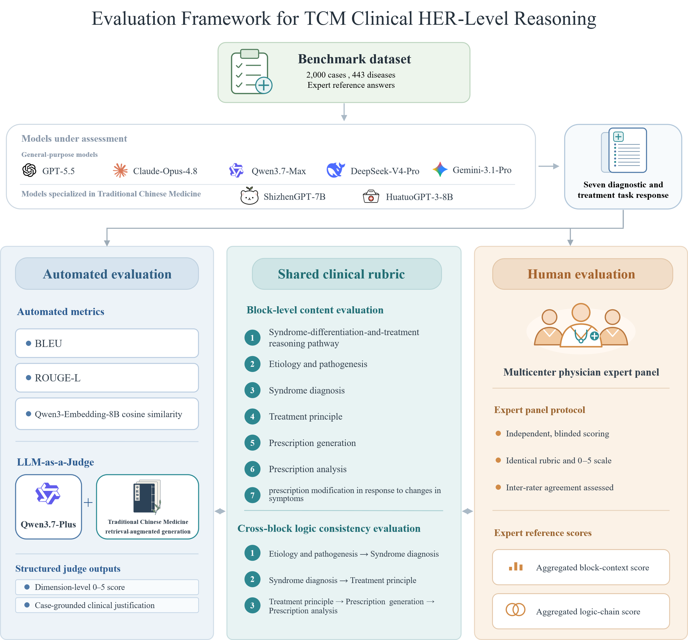
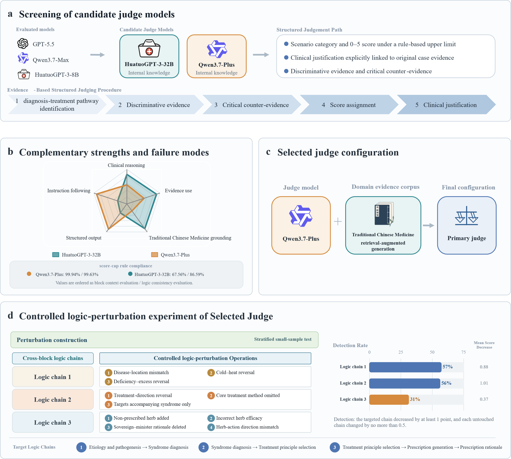

<div align="center">


[](LICENSE)
[](#-dataset)
[](#-dataset)
[](#-benchmark-design)

</div>

<p align="center">
  
</p>
<p align="center"><i>Figure 1: Overall evaluation framework of TCM-ClinicalReason.</i></p>

## 📋 Table of Contents

- [Introduction](#-introduction)
- [Benchmark Design](#-benchmark-design)
- [Dataset](#-dataset)
- [Preliminary Study](#-preliminary-study)
- [Evaluation and Leaderboard](#-evaluation-and-leaderboard)
- [Data Access](#-data-access)
- [Repository Structure](#-repository-structure)
- [Citation](#-citation)
- [License and Contact](#-license-and-contact)

## 📖 Introduction

TCM-ClinicalReason is a benchmark built from 2,000 authentic clinical case records documented by renowned senior TCM physicians, curated from multicenter electronic health records and published TCM case reports. Each case is decomposed into a complete seven-step diagnostic and therapeutic sequence, and model outputs are scored along two complementary axes: **case-grounded content adequacy** of each reasoning block and **logic consistency** across the dependencies between blocks. The benchmark is designed to accept clinically defensible alternative pathways rather than reward string overlap with a single reference answer.

## 🧩 Benchmark Design

Each case requires an open-ended response covering **seven sequential reasoning blocks**:

1. Syndrome differentiation and treatment reasoning pathway
2. Etiology and pathogenesis analysis
3. Syndrome diagnosis
4. Treatment principle
5. Prescription generation
6. Prescription analysis
7. Prescription modification in response to symptom changes

On top of the blocks, **three cross-block logic relations** are scored separately:

- Etiology and pathogenesis → syndrome diagnosis
- Syndrome diagnosis → treatment principle
- Treatment principle → prescription generation → prescription analysis

Cases are stratified into three difficulty tiers (easy 666 / medium 667 / hard 667) using embedding-based similarity between reference answers and the outputs of two TCM-specialized models, so that performance can be read as a function of case complexity.

## 📊 Dataset

The released test set comes in two aligned subsets. Both contain the same 2,000 cases with the same ids; they differ only in task format.

| Subset | File | Task format |
|---|---|---|
| **TCMCR-Reasoning** | `data/TCMCR-Reasoning.json` | Full seven-block analysis: the model reads the case and produces the complete diagnostic and therapeutic sequence (reasoning pathway, etiology and pathogenesis, syndrome diagnosis, treatment principle, prescription, prescription analysis, prescription modification). This is the format used for all results reported below. |
| **TCMCR-QA** | `data/TCMCR-QA.json` | Single-turn question answering: the model is asked directly for the syndrome, treatment principle, and herbal formula for the case. |

**TCMCR-Reasoning fields**

| Field | Description |
|---|---|
| `id` | Case id, `TCMCR-0001` to `TCMCR-2000`, shared across both subsets |
| `instruction` | Task instruction requesting the seven-block analysis |
| `input` | Patient case record and current symptoms (Chinese) |
| `disease` | Western-medicine disease label of the case |
| `difficulty` | Case difficulty tier: `easy`, `medium`, or `hard` |

**TCMCR-QA fields**

| Field | Description |
|---|---|
| `id` | Case id, aligned with TCMCR-Reasoning |
| `problem` | Question combining a concise instruction with the case record |
| `disease` | Western-medicine disease label of the case |
| `difficulty` | Case difficulty tier: `easy`, `medium`, or `hard` |

**Table 1: Test set statistics**

| Statistic | Value |
|---|---|
| Cases | 2,000 |
| Distinct Western-medicine diseases | 443 |
| Distinct ICD-11 codes | 288 |
| ICD-11 chapters covered | 19 |
| Difficulty tiers (easy / medium / hard) | 666 / 667 / 667 |

The gold labels (reference chain of thought, reference answer, and the seven-block decomposed reference labels) are not included in this repository and are available through gated access; see [Data Access](#-data-access).

## 🔬 Preliminary Study

Before the formal run, two candidate judges were compared head to head on the outputs of three models over all 2,000 cases: a general-purpose judge (Qwen3.7-Plus) and a TCM-specialized judge (HuatuoGPT-3-32B). The general-purpose judge followed the score-cap rules of the rubric far more reliably (99.9 versus 67.6 percent compliance on content scoring), covered every case with stable structured output, separated responses within the same case more sharply, and showed no sign of same-family preference. The TCM-specialized judge interpreted tongue, pulse, formula, and materia medica findings more specifically, but violated the rubric more often and rated answers from its own model family noticeably higher. **Qwen3.7-Plus augmented with TCM-specific retrieval (TCM-RAG)** was therefore selected as the primary judge, with the specialized model retained for qualitative error review.

The selected judge was then stress-tested with controlled logical perturbations: single targeted errors were injected into model responses for 100 stratified cases, yielding 900 matched original-perturbed pairs across the three logic relations. The judge reliably penalized explicit contradictions such as cold-heat reversal and treatment-direction reversal (detection rates of 57 and 56 percent on the first two relations), and was less sensitive to omission-type errors in prescription analysis (31 percent on the third relation), which bounds the kinds of reasoning errors the reported scores can be trusted to reflect.

<p align="center">
  
</p>
<p align="center"><i>Figure 2: Judge selection and validation: candidate screening, complementary strengths, selected configuration, and the controlled logic-perturbation experiment.</i></p>

## 🏆 Evaluation and Leaderboard

Models are evaluated in three layers. Automated text metrics (BLEU, ROUGE-L, and embedding cosine similarity) are computed as a complementary reference but are not used for ranking. The primary measure is the LLM judge selected above, which scores every response under an evidence-constrained rubric: each judgment must identify the diagnostic pathway, cite case-specific discriminating evidence and the strongest counterevidence, and assign a 0 to 5 score bounded by scenario-dependent caps. As a validity anchor, a blinded multicenter panel of five TCM physicians scored a stratified nine-case subset with the same rubric.

Seven models were evaluated: five general-purpose models and two TCM-specialized models. Content covers the seven blocks and logic consistency covers the three cross-block relations.

**Table 2: Results on TCMCR-Reasoning, LLM judge and human expert panel**

| Model | Content (%) | Logic Consistency (%) | Expert Content (0-5) | Expert Logic (0-5) |
|---|---:|---:|---:|---:|
| GPT-5.5 | **54.1** | **66.8** | **3.75** | **4.05** |
| Claude-Opus-4.8 | 54.0 | 66.0 | 3.42 | 3.88 |
| DeepSeek-V4-Pro | 48.5 | 65.4 | 3.37 | 3.86 |
| Gemini-3.1-Pro | 47.7 | 64.5 | 2.87 | 3.64 |
| Qwen3.7-Max | 45.8 | 64.7 | 3.35 | 3.76 |
| ShizhenGPT-7B | 41.8 | 62.4 | 2.97 | 3.60 |
| HuatuoGPT-3-8B | 40.7 | 60.8 | 2.76 | 3.30 |

<i>Judge columns are normalized scores over all 2,000 cases. Expert columns are the consensus mean of the five physicians on the nine-case subset (0 to 5 scale). The two scales are not directly comparable in absolute terms; the judge is a stricter but directionally aligned measure.</i>

<p align="center">
  
</p>
<p align="center"><i>Figure 3: Content and cross-block logic consistency scores of the seven evaluated models.</i></p>

In the expert study, models were anonymized as A to G with letters re-randomized per case, and each of the five physicians scored all 63 responses (3,150 ratings, no missing values). The panel and the judge identify the same leaders and the same laggards: model-ranking agreement reaches Kendall tau-b 0.52 for content and 0.78 for logic consistency, within-case orderings agree beyond chance (p < 0.001 for both tasks), and the judge scores systematically lower than the expert consensus.

## 🔐 Data Access

The test set in `data/` is publicly available. Access to the **gold labels** is gated and manually reviewed. To request access:

1. Download and complete either the [Chinese application form](form/TCM-ClinicalReason_Label_Access_Application_Form_CN.docx) or the [English application form](form/TCM-ClinicalReason_Label_Access_Application_Form_EN.docx).
2. Email the completed form to **zhiliu@njucm.edu.cn**. Suggested subject: `[TCM-ClinicalReason Label Access Application] Applicant name or institution name`.
3. Each application will be reviewed individually. Approved applicants will be notified by email and provided with instructions for obtaining the gold labels.

Please make sure the contact email in the form is the one you want the notification sent to.

## 📁 Repository Structure

```
TCM-ClinicalReason/
├── assets/                                                  # Logo and figures used in this README
│   ├── logo.svg
│   ├── overview.png
│   ├── judge_selection.png
│   └── results.png
├── data/
│   ├── TCMCR-Reasoning.json                                 # 2,000 cases, seven-block format
│   └── TCMCR-QA.json                                        # 2,000 cases, single-turn QA format
├── form/
│   ├── TCM-ClinicalReason_Label_Access_Application_Form_CN.docx
│   └── TCM-ClinicalReason_Label_Access_Application_Form_EN.docx
├── LICENSE                                                  # CC BY-NC 4.0
└── README.md
```

## 📜 Citation

Coming soon.

## 📄 License and Contact

This dataset is released under the [CC BY-NC 4.0](LICENSE) license for non-commercial research use. Model outputs on this benchmark must not be used as a direct basis for clinical diagnosis or treatment.

For questions and label access requests: **zhiliu@njucm.edu.cn**
